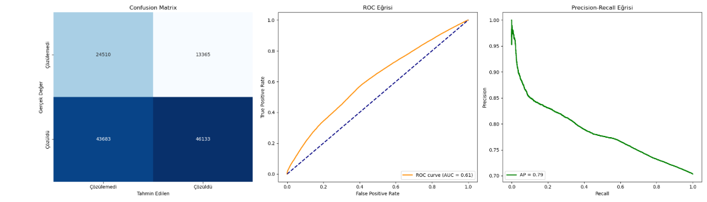
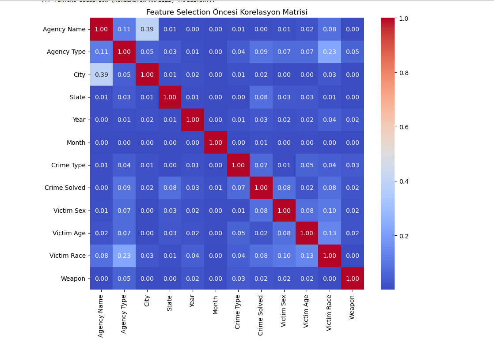

# 🕵️‍♂️ US Crime Analytics: Suç Çözülebilirlik Tahmini


> **Veri Madenciliği Projesi** | **Hazırlayan:** [Adın Soyadın]

---

## 📖 Proje Hakkında
Binlerce vaka, milyonlarca veri satırı... Bir suçun faili meçhul kalıp kalmayacağını önceden tahmin edebilir miyiz?

Bu proje, **1980-2014** yılları arasındaki ABD suç istatistiklerini (US Crime Data) inceleyerek, işlenen bir suçun **çözülüp çözülemeyeceğini (Solved vs. Unsolved)** makine öğrenmesi ile öngörmeyi amaçlar. Sınıflandırma algoritması olarak **Logistic Regression** kullanılmış, model öncesi veri analizinde ise **Korelasyon Matrisi** üzerinden özellik seçimi yapılmıştır.

## 🛠️ Teknik Yaklaşım

### 1. Neden Logistic Regression?
Karmaşık modeller yerine, bu problem için en sağlam temellere sahip olan Logistic Regression tercih edildi:
* **Binary Classification:** Hedefimiz net (0 veya 1).
* **Şeffaflık:** Hangi değişkenin suçu çözmede daha etkili olduğunu katsayılarla görebiliyoruz.
* **Hız:** 100 MB üzerindeki büyük veri setlerinde bile çok hızlı eğitim süresi sunuyor.

### 2. Veri Yönetimi & Feature Selection
Veri setindeki değişkenler körü körüne modele sokulmadı.
* **Veri Temizliği:** Kayıp veriler (Null values) ve hatalı girişler temizlendi.
* **Korelasyon Analizi:** Özelliklerin birbirleriyle ve hedef değişkenle olan ilişkisi görselleştirildi. Modelin kafasını karıştırabilecek (multicollinearity yaratan) değişkenler elendi.

---

## 📊 Model Performansı

Model başarısı sadece doğruluk (accuracy) oranıyla değil; dengesiz veri setlerinde kritik olan **ROC Curve** ve **Precision-Recall** metrikleriyle ölçülmüştür.

### 📉 Metrikler ve Başarı Grafikleri
Aşağıdaki panelde modelin **Confusion Matrix**, **ROC** ve **Precision-Recall** eğrilerini görebilirsiniz:



### 🌡️ Değişken İlişkileri (Heatmap)
Özelliklerin korelasyon haritası:



---

## 📂 Dosya Yapısı

```text
📦 US_Crime_Prediction
 ┣ 📂 images
 ┃ ┣ 📜 model_performance_metrics.png  # Performans grafikleri
 ┃ ┗ 📜 correlation_matrix.png         # Isı haritası
 ┣ 📜 .gitignore                       # Gereksiz dosyaların temizliği
 ┣ 📜 main.ipynb                       # Kaynak kodlar (Notebook)
 ┣ 📜 README.md                        # Proje dokümanı
 ┗ 📜 US_Crime_DataSet.rar             # ⚠️ Veri Seti (Sıkıştırılmış)

---

## 🚀 Kurulum

Veri setinin boyutu GitHub sınırlarını (~100MB) aştığı için **sıkıştırılarak (.rar)** yüklenmiştir. Projeyi çalıştırmak için:

1.  **Repoyu indirin:**
    ```bash
    git clone [https://github.com/KULLANICI_ADINIZ/REPO_ADINIZ.git](https://github.com/KULLANICI_ADINIZ/REPO_ADINIZ.git)
    ```
2.  **Veriyi Hazırlayın (Önemli Adım):**
    * Klasör içindeki `US_Crime_DataSet.rar` dosyasına sağ tıklayın.
    * **"Buraya Çıkar" (Extract Here)** diyerek `.csv` dosyasını ana dizine çıkarın.
3.  **Gerekli Kütüphaneleri Yükleyin:**
    ```bash
    pip install pandas numpy seaborn matplotlib scikit-learn
    ```
4.  **Çalıştırın:**
    * `main.ipynb` dosyasını Jupyter Lab veya Notebook ile açıp `Run All` yapmanız yeterlidir.

---

## 💡 Kazanımlar

* **Big Data Handling:** Büyük boyutlu veri setlerinin Git LFS veya sıkıştırma yöntemleriyle versiyon kontrol sistemlerinde nasıl yönetileceği deneyimlendi.
* **Preprocessing:** Ham verinin (Raw Data) modele girmeden önce geçirdiği dönüşüm süreçlerinin model başarısındaki kritik rolü gözlemlendi.
* **Git Flow:** `.gitignore` kullanılarak temiz bir repo yönetimi sağlandı.

---
*Bu proje eğitim amaçlı hazırlanmıştır.*
